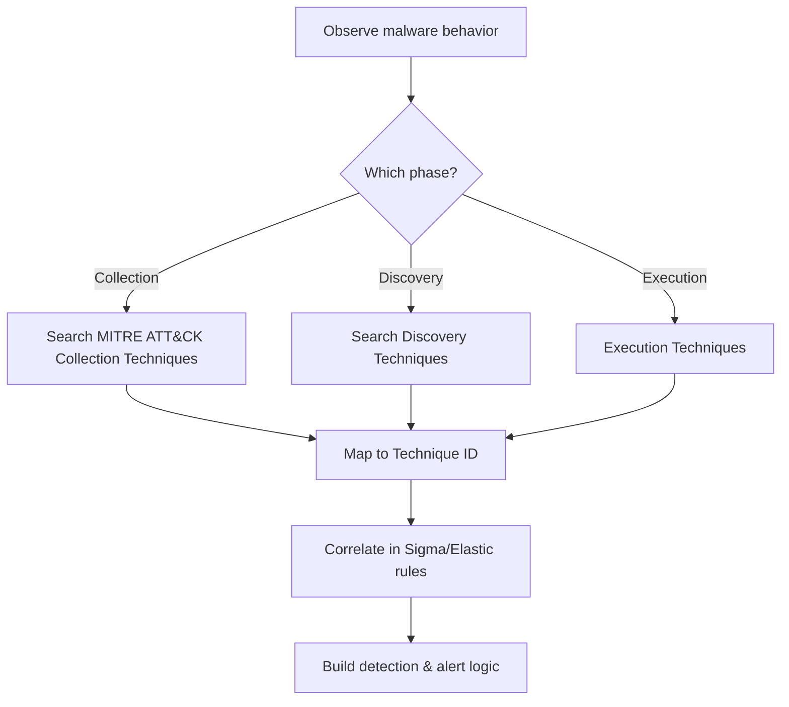

# 🔍 MITRE ATT&CK Technique Mapping Cheatsheet for Malware Behavior

Understanding how malware operates is crucial for strategic detection and defense. This cheatsheet helps you **map observed malware behavior** (from sandbox analysis, PCAPs, logs, etc.) to **MITRE ATT&CK technique IDs** using practical tools.

---

## 🧠 Core Strategy

### 🧭 Step-by-step
1. **Observe the behavior**
   - What does the malware do before exfiltration?
   - Does it collect files? Take screenshots? Log keystrokes?

2. **Match behavior to MITRE ATT&CK**
   - Use MITRE’s [official techniques list](https://attack.mitre.org/techniques/)
   - Focus on the **Collection** and **Discovery** tactics for pre-exfiltration stages.

3. **Validate with tools and public sources**

---

## 🔧 Useful Tools for Technique Identification

### 🧪 VirusTotal (https://virustotal.com)
- Go to the **Behavior** tab after uploading a file.
- Look for:
  - File access / directory listings
  - Registry reads/writes
  - Screenshots, clipboard access
- Check **"Execution Parents"** and **"Calls"** for suspicious APIs.

### 🕵️‍♂️ Hybrid Analysis (https://www.hybrid-analysis.com)
- Focus on the **Behavioral Analysis → System Behavior**
- Key indicators:
  - `Reads the active computer name` → T1082 (System Information Discovery)
  - `Creates an archive` → T1560.001 (Archive via Utility)
  - `Collects keyboard input` → T1056.001 (Keylogging)
- Bottom panel may auto-map to MITRE (look under "Tactic/Technique").

### 🧬 Uncoder.IO (https://uncoder.io)
- Convert **behavior descriptions or logs** into:
  - MITRE Tactic/Technique
  - Sigma rules
  - Elastic/KQL/SQL detection queries
- Try inputting: `powershell downloading executable` or `psexec service start`

---

## 📘 Common Technique Mappings

| Malware Behavior                       | Technique ID | MITRE Technique Name                      |
|----------------------------------------|--------------|-------------------------------------------|
| Reading user files                     | T1005        | Data from Local System                    |
| Taking screenshots                     | T1113        | Screen Capture                            |
| Capturing keystrokes                   | T1056.001    | Keylogging                                |
| Listing files and directories          | T1083        | File and Directory Discovery              |
| Enumerating system information         | T1082        | System Information Discovery              |
| Capturing clipboard contents           | T1115        | Clipboard Data                            |
| Creating zip/rar archives              | T1560.001    | Archive via Utility                       |
| Finding installed software             | T1518.001    | Software Discovery                        |
| Reading computer/hostname              | T1082        | System Information Discovery              |

---

## 📁 Where Else to Look for T-Mappings

- ✅ [Elastic Detection Rules](https://github.com/elastic/detection-rules)
  - Check YAML files — most include `attack.tactic` and `attack.technique`.

- ✅ [Sigma Rules Repo](https://github.com/SigmaHQ/sigma)
  - Each rule often maps to MITRE ID (`attack.tid`).

- ✅ Threat Reports from:
  - FireEye / Mandiant
  - CrowdStrike
  - SentinelOne
  - Look for "MITRE" or "T1xxx" references.

---

## 🧠 Pro Tips

- Use **Wireshark** filters like `smb2`, `ldap`, or `ntlmssp` to identify authentication & collection behaviors (e.g., target name = domain controller).
- Look for PsExec-style lateral movement? → Check `SMB`, ports `445/135`, and identify `admin$` shares.
- Don't forget **File IOCs** (hashes, dropped files) → cross-reference with ATT&CK behaviors.

---

## ✨ Workflow Summary


💡 Keep this cheatsheet updated with new TIDs and sandbox findings. Your red/blue skills grow with each trace you follow.
If unsure, ask yourself: “What is the adversary trying to understand or collect?”

▐▓█▀▀▀▀▀▀▀▀▀█▓▌
▐▓█░░▀░░▀▄░░█▓▌
▐▓█░░▄░░▄▀░░█▓▌
▐▓█▄▄▄▄▄▄▄▄▄█▓▌
    ▄▄███▄▄
                   ╱|、
                 (˚ˎ 。7  
                  |、˜〵          
                 じしˍ,)ノ

```